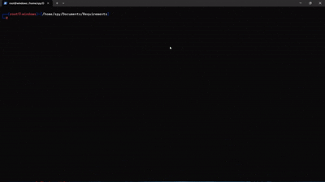

# ScanFlow — Interactive Nmap Automation Tool 🔎

[](https://github.com/Harsh-katiyar/scanflow-nmap-automation/stargazers)
[](https://github.com/Harsh-katiyar/scanflow-nmap-automation/network/members)
[](https://github.com/Harsh-katiyar/scanflow-nmap-automation/issues)
[](LICENSE)

## 🚀 About ScanFlow
**ScanFlow** is an **interactive Nmap automation tool** that helps penetration testers, bug bounty hunters, and cybersecurity learners run **powerful Nmap scans without memorizing complex commands**.  

---

## ✨ Features
- 🎯 **Target Options** — Single IP, range, CIDR, domain, or input file  
- 🌐 **Host Discovery** — ICMP, TCP, UDP, DNS, ARP, etc.  
- ⚡ **Scan Techniques** — SYN, Connect, UDP, Null, Xmas, Idle scans  
- 🔍 **Port Specification** — Custom ranges, top ports, exclusions  
- 🕵️ **Service & Version Detection** — Banner grabbing, NSE integration  
- 🖥️ **OS Detection** — Basic & aggressive fingerprinting  
- 🛡️ **Evasion Techniques** — Firewall bypass, decoys, timing options  
- 📂 **Output Formats** — Normal, Grepable, XML, All formats  
- 📝 **Final Command Preview** — Copy-ready Nmap command  

---

## 📸 Demo
Here’s how **ScanFlow** works in action 👇



---

## 🔧 Installation
```bash
# Clone the repository
git clone https://github.com/Harsh-katiyar/scanflow-nmap-automation.git
cd scanflow-nmap-automation

# Make script executable
chmod +x ScanFlow.py

# Run
python3 ScanFlow.py
```
